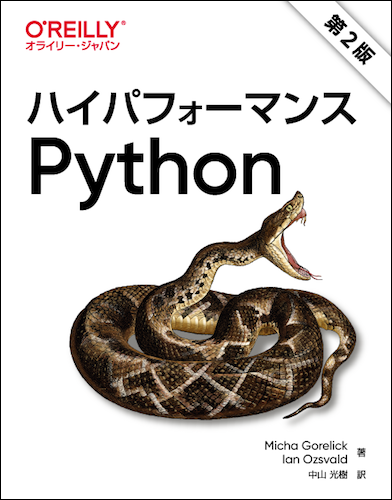

# ハイパフォーマンスPython 第2版

---

---

本リポジトリはオライリー・ジャパン発行書籍『[ハイパフォーマンスPython 第2版](https://www.amazon.co.jp/dp/4873119901/)』のサポートサイトです。

## サンプルコード

各章ごとにノートブックを用意しています。また、それぞれのノートブックはGoogle Colaboratoryを使いブラウザで実行できます。

- [1章のサンプルコード](https://colab.research.google.com/drive/1_2IGFvI2VcQ-dWAqDB7NvyVtXFy-Xx3r?usp=sharing)
- [2章のサンプルコード](https://colab.research.google.com/drive/1vFL6x7x4or-0V365Oow_FVZMW_Y-LMTS?usp=sharing)
- [3章のサンプルコード](https://colab.research.google.com/drive/15YZolvboJJPXHNo--FPoRmN60TxcWck7?usp=sharing)
- [4章のサンプルコード](https://colab.research.google.com/drive/1gUfeBJAwkj-znbIIYgu9Zb6NIXddVZCI?usp=sharing)
- [5章のサンプルコード](https://colab.research.google.com/drive/1FMsdYXHwYVmfoKbf8-Pq-DJkfU7TMzGF?usp=sharing)
- [6章のサンプルコード](https://colab.research.google.com/drive/172lSkTbm1Bhh9_l21PurxvweiYyeh8bg?usp=sharing)
- [7章のサンプルコード](https://colab.research.google.com/drive/1i9iayVsCwSAc17Q8L7V8f50sbuqR1upe?usp=sharing)
- [8章のサンプルコード](https://colab.research.google.com/drive/1YYjqO3YP7DsF1VwoDawb4sewY6Mu2G0D?usp=sharing)
- [9章のサンプルコード](https://colab.research.google.com/drive/1sMUo9Ox75MxqlyySjPUAZo1suuXNaohP?usp=sharing)
- [10章のサンプルコード](https://colab.research.google.com/drive/1IIz3-yVPk71LXB-xhaNZA93XNRaLZ_B_?usp=sharing)
- [11章のサンプルコード](https://colab.research.google.com/drive/1bvejDrif_PgaRpELVumvZ6pMmo4a7pjw?usp=sharing)
- [12章のサンプルコード](https://colab.research.google.com/drive/139L880dwNM-9cYjOci-ajZvIrW-Oe-qp?usp=sharing)

## 正誤表

まだありません。誤植など間違いを見つけた方は、japan@oreilly.co.jpまでお知らせください。
